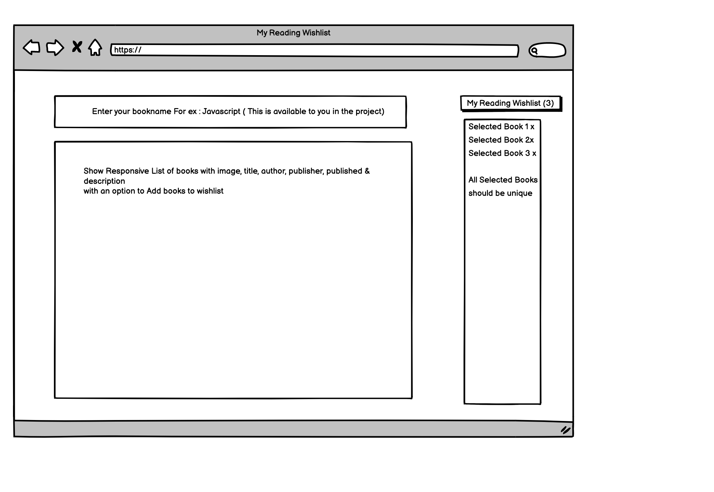

# eBay React Coding Exercise Repo
Thank you for your interest in eBay Engineering Team. This repo contains exercises used in eBay's recruitment process. These exercises are used for all frontend engineering roles, at all levels.

Please complete the coding exercises below, upload code to a personal git repo, and share the link to your repo.

#### Please don't fork this repo. Download/Clone the repository, finish the exercise and upload it as a new repository in your github account. Share with us the link for that repository

## Prerequisites 
To build and run the sample code please make sure you have the following prerequisites
- NodeJs v13.12 or higher
- Yarn

## Getting Started
This repository contains a sample ReactJs application.   When launched the sample web application displays a "search" box where you can enter a book name and press ENTER. Results matching your input will be displayed as a JSON String.  
You can follow the instruction below to launch the sample application.
1. Install dependencies using `yarn`
2. Launch the web application using `yarn start` 
3. Navigate to [http://localhost:3000](http://localhost:3000)
4. You can run tests using `yarn test` 

Please feel free to make your own decisions about Web UI development. Though you are can use any UI library to build the web page, please see if you can avoid them. Also, you may use any state management technique.

## Coding Exercise
Please complete the following coding exercises and submit your code to us.  

### Exercise 1: Design a web page in line with the mockup. 
> Requirement 1: As a user, I want to see a responsive page similar to the mockup. Sample JSON response is returned when the search term is entered and submitted in the search box. 

> Requirement 2: As a user, I want to add books to my wishlist displayed on right section of the web page. 

> Some helpful fields available in the response that helps you in building the mocks are:  image (coverUrl), title, author, publisher, published & description

Please test your code for accessibility and make sure it is accessible.

### Exercise 2: Add instant search capabilities
> Requirement 1: As a user, I want to see book results as I am typing in the search field. I don't want to have to submit the form to view search results.

Please make sure you are not spamming the API with too many calls. No more than one request every 500 ms.

### Exercise 3: Unit tests
Write unit tests for your code.

## How to submit code?
Please upload completed code to a personal git repository and share the link to your repository with us.
